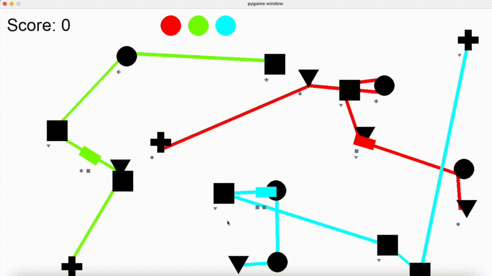

# Computational Intelligence for Games Final Project - Mini Metro

## Description
My goal was to develop an AI agent for the game Mini Metro. Originally, I intended to use Q-learning, but I soon found out that the state/ action space is way too large, and simulating the game is slow. I switched my plan towards implementing a genetic algorithm, and now my AI agent works by beginning with random valid configurations provided by a rules-based heuristic agent, then it proceeds by evaluating each configuration, selecting some individual configurations to become parents (90% are from the best-performing parents aka exploitation, 10% are random aka exploration), using these as parents to perform crossover (to create children configurations), mutate the children by turning any line into a loop with 10% probability, test the next generation which is split between parents and children (they will compete in the next iteration), and I repeat until done.

The objective is to maximize passenger trips (as is the score metric for the original game). However, this implementation of Mini Metro did not take into account station overcrowding (this is the mechanic by which you lose in the original game). So, I added this functionality myself, and working within the constraints of this specific implementation that requires the game to keep running, I simply reset a configuration's score to 0 if any stations overcrowd. As we are trying to maximize our score, resetting to zero acts as a penalty that will naturally lead to selecting configurations where stations overcrowd.

When running agent_play.py, you will see the map display a configuration of lines connecting stations operating at 10x speed. Every 5 seconds, the map will switch to a different configuration. This represents an episode of calculating the reward of the configuration.

## Research Question
Can we use a genetic algorithm to find an optimal configuration of stations and lines to maximize passenger trips that outperforms a simple rules-based agent?

Ans: Yes. Although algorithm will sometimes stabilize around a local maximum that is marginally better than the heuristic agent, it still uncovers solutions that significantly outperform the benchmark. 
With the given settings in config.py, a rules-based agent scores approximately 50, but our algorithm is able to score as high as 70. 

## Credit
Much of this codebase was originally written by Yanfeng Liu (https://github.com/yanfengliu/python_mini_metro), but I've specifically built atop the modifications made to this codebase by Chi-Hui Lin (https://github.com/Ttopiac/AI-Mini-Metro). I built my agent using the "Agent" class provided by Lin for ease of interfacing with the game, but the code contained within the rules_based_agent.py file is my own. Likewise, I referenced Lin's original agent_play.py file to understand how to interface with the game (specifically regarding pygame set-up lines 0-23 and 51-54, and pygame-user interaction lines 209-222), but all the remaining lines implementing the genetic algorithm in agent_play.py are my own.

A few other files have been modified slightly, including the configuration file and the station & mediator files (in order to add the station overcrowding mechanic that was not implemented by Liu)

## Installation
`pip install -r requirements.txt`

## How to run
### To play the game manually
* Go to `config.py` and set agent_play variable to False
* Run `python src/user_play.py`
### To let the agent play the game
* Go to `config.py` and set agent_play variable to True
* Run `python src/agent_play.py`
